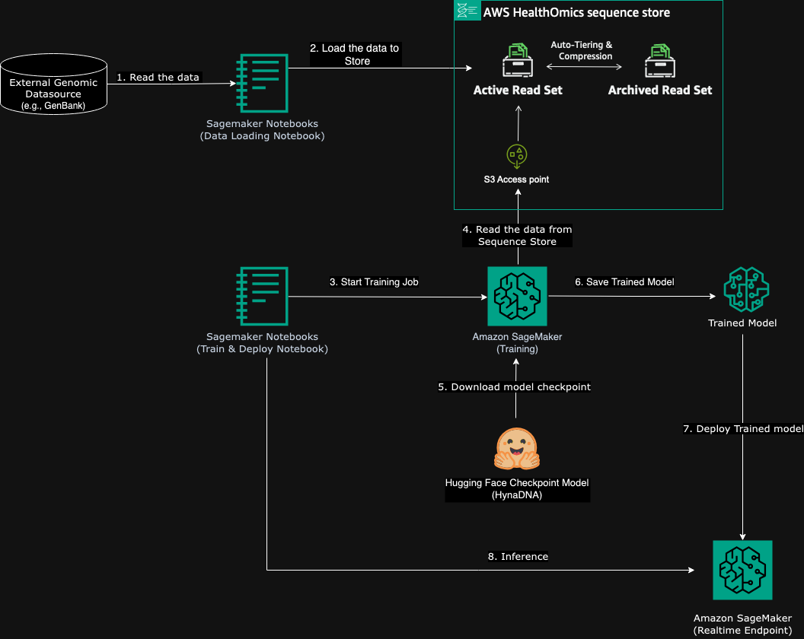
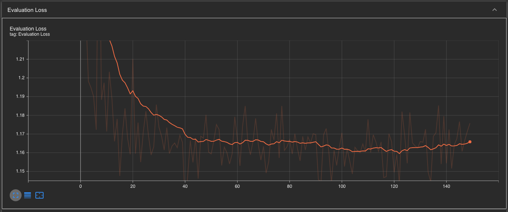
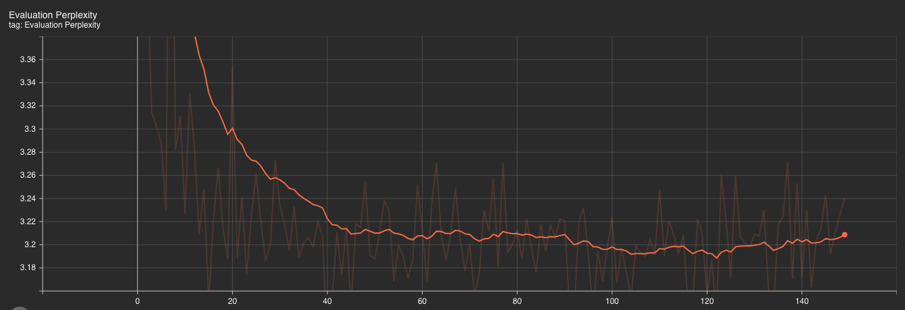
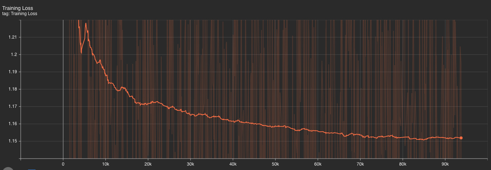
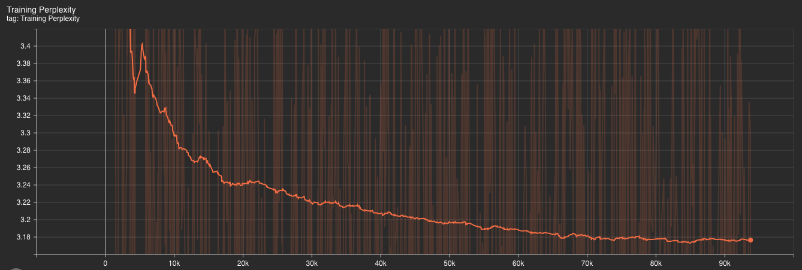

## Genomic language model pretraining with the HealthOmics sequence store

In this repo we show how you can use AWS infrastructure---AWS HealthOmics and AWS Sagemaker---to
to easily and cost-effectively pre-train a genomic language model, [HyenaDNA](https://arxiv.org/pdf/2306.15794.pdf).

## Solution Overview

The solution illustrates an architecture diagram for training HyenaDNA model using the data stored in AWS HealthOmics sequence store.

1. Read the Data: Data is read from an external genomic data source, such as GenBank.
2. Load the Data to Store: The data is then loaded into an AWS HealthOmics sequence store using Data Loading SageMaker Notebook.
3. Start Training Job: Utilizes SageMaker train & Deploy Notebook to initiate a training job on Amazon SageMaker.
4. Read the Data from Sequence Store: Training job accesses data from the Sequence Store using S3 access point of sequence store.
5. Download Model Checkpoint: A model checkpoint from Hugging Face (HyneDNA model) is downloaded.
6. Save Trained Model: The trained model is saved following the training process.
7. Deploy Trained Model: The trained model is then deployed using Amazon SageMaker, establishing a real-time endpoint.
8. Inference: Finally, the model performs inference tasks, likely using the deployed SageMaker real-time endpoint.

## Installation & First Steps

1. Clone this repo in a SageMaker notebook.
2. If you don't already have your genomic data (FASTA files) in a sequence store, then use the `load-genome-to-sequence-store.ipynb` notebook to do so.
3. Use the `hyenaDNA-training.ipynb` notebook to initiate a training job.

## Results

This plots the evaluation loss of a HyenaDNA model training over a series of epochs. The overall trend suggests that the model's loss decreased significantly early in the training and reached a plateau, indicating potential convergence of the model training process.

This plots the evaluation perplexity values of HyenaDNA model during its training over a sequence of epochs. This decreasing trend followed by stabilization indicates that the model's ability to predict or understand the data improved quickly initially and then reached a level of consistency as training progressed.

This plots the training loss of HyenaDNA model over training steps. In this graph, the training loss decreases sharply initially, which is typical as the model begins to learn from the data. After this initial drop, the loss continues to decrease more gradually and eventually stabilizes around the 1.15 mark. This suggests that the model is converging.

This plots the perplexity values of a machine learning model over training steps. training perplexity, which demonstrates a significant decrease early on, followed by a gradual decline and stabilization around 3.2. This behavior suggests that as training progresses, the model becomes increasingly efficient at predicting or understanding the training data, indicated by the decreasing perplexity values. The stabilization at a lower perplexity level indicates that the model has likely achieved a good level of generalization.

## Security

See [CONTRIBUTING](CONTRIBUTING.md#security-issue-notifications) for more information.

## License

This library is licensed under the MIT-0 License. See the LICENSE file.

