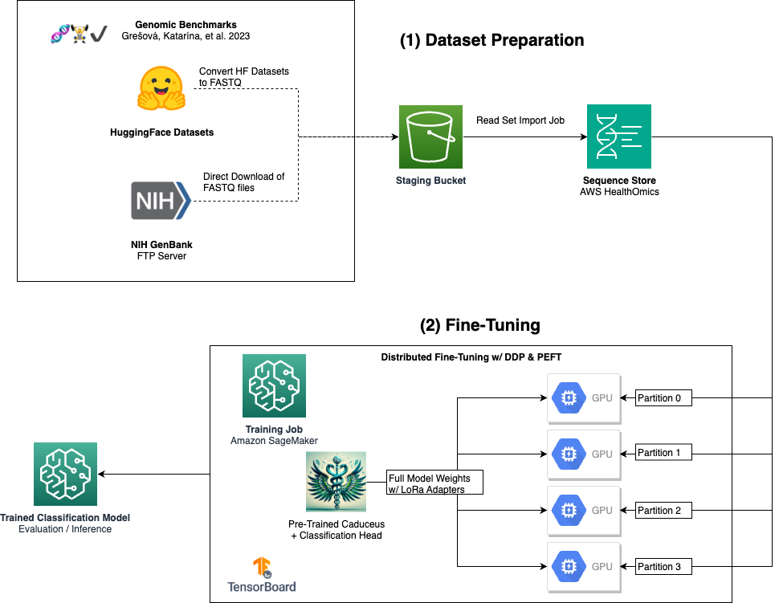
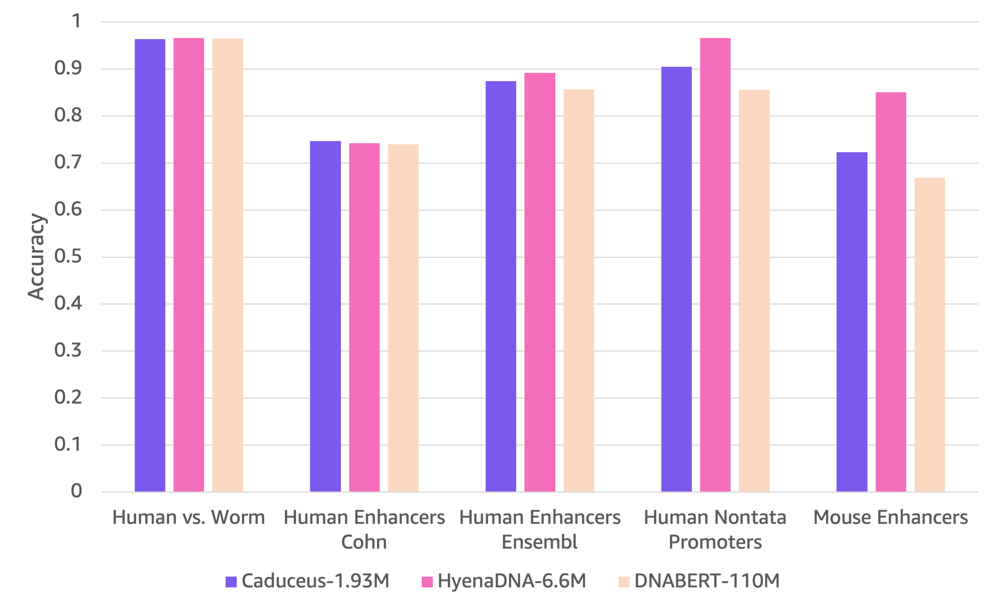
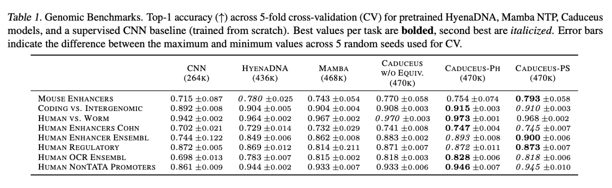

# Fine-Tune Caduceus (Mamba-Based DNA Sequence Foundation Model) for Genomic Benchmarks

This module demonstrates a workflow for fine-tuning a pre-trained [Caduceus](https://arxiv.org/abs/2403.03234) foundation model for a series of DNA sequence classification tasks included in [Genomic Benchmarks](https://bmcgenomdata.biomedcentral.com/articles/10.1186/s12863-023-01123-8).

**Caduceus** is a **State Space Model** (SSM) built on an adapted form of the [Mamba](https://arxiv.org/abs/2312.00752) architecture. SSM's have advantageous scaling properties compared to attention-based models like [DNABERT](https://www.biorxiv.org/content/10.1101/2020.09.17.301879v1) and the [Nucleotide Transformer](https://www.biorxiv.org/content/10.1101/2023.01.11.523679v1), allowing them to learn from significantly longer context lengths with fewer model weights. At the time of writing, Caduceus represents the state of the art on a range of downstream DNA sequence tasks, but with a fraction of the parameters of DNABERT.

In this project, we will adapt and fine-tune a pre-trained Caduceus model for DNA sequence classification tasks provided by the Genomic Benchmarks datasets. While these benchmark datasets are publicly available on HuggingFace, we also provide an optional workflow to import the sequences into [AWS HealthOmics](https://aws.amazon.com/healthomics/) and pull them into the fine-tuning job. Genomic research organizations who have access to their own, proprietary sequence datasets (e.g. FASTA/FASTQ/BAM format), could use a similar workflow to train custom models.

The architecture consists of two main notebooks.

* The first [notebook](load_genomic_benchmarks_to_omics.ipynb) is **optional**, but it demonstrates how to take the publicly-available Genomic Benchmark datasets from HuggingFace, convert them into a format compatible with HealthOmics, and import them into a Sequence Store.
* The second [notebook](train_caduceus_benchmarks.ipynb) uses Amazon Sagemaker to fine-tune a pre-trained version of the Caduceus model for the Genomic Benchmark tasks. The [training script](scripts/train_caduceus_dist.ipynb) is highly configurable, and supports [Distributed Data Parallel](https://pytorch.org/tutorials/intermediate/ddp_tutorial.html) (DDP) to accelerate training in multi-GPU scenarios. We also have an option to use [Parameter Efficient Fine-Tuning](https://huggingface.co/docs/peft/en/index) (PEFT) to limit the number of trainable parameters for greater memory efficiency and speed.

Even when starting with a [mid-range variant (1.93M)](https://huggingface.co/kuleshov-group/caduceus-ps_seqlen-1k_d_model-256_n_layer-4_lr-8e-3) of the model and using PEFT, we are able to see performance on par with (or exceeding) the full-size (6.6M) state-of-the-art [HyenaDNA](https://hazyresearch.stanford.edu/blog/2023-06-29-hyena-dna) model, and consistently surpassing the 50x larger DNABERT (110M).

These results align with those presented in the Caduceus paper, where they show even better performance across all Genomic Benchmark tasks with a full-scale version of the model and further fine-tuning.

## References

[Schiff, et al. Caduceus: Bi-Directional Equivariant Long-Range DNA Sequence Modeling (2024)](https://arxiv.org/pdf/2403.03234)

[Grešová, et al. Genomic benchmarks: a collection of datasets for genomic sequence classification (2023)](https://doi.org/10.1186/s12863-023-01123-8)

[Gu and Dao. Mamba: Linear-Time Sequence Modeling with Selective State Spaces (2024)](https://arxiv.org/abs/2312.00752)

[Nguyen, et al. HyenaDNA: Long-Range Genomic Sequence Modeling at Single Nucleotide Resolution (2023)](https://arxiv.org/abs/2306.15794)
