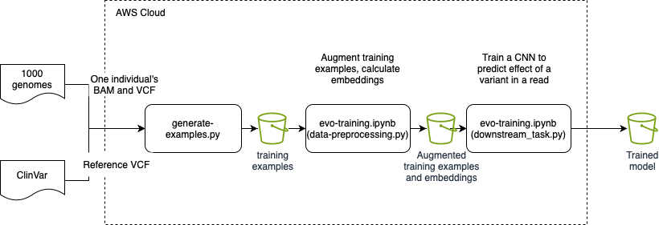

# Training a downstream supervised regression task using the Evo model

The Evo model [[blog post]](https://arcinstitute.org/news/blog/evo) [[bioRxiv]](https://www.biorxiv.org/content/10.1101/2024.02.27.582234v1) [[Github]](https://github.com/evo-design/evo) is a biological foundation model designed for long-context modeling and sequence design. Built on the [StripedHyena architecture](https://github.com/togethercomputer/stripedhyena), it models sequences at single-nucleotide, byte-level resolution with near-linear compute and memory scaling as context length increases. With 7 billion parameters, Evo is trained on OpenGenome, a prokaryotic whole-genome dataset of  ~300 billion tokens.

Here we show how to use AWS infrastructure---AWS Sagemaker and Amazon S3---to easily and cost-effectively train a downstream supervised regression task using embeddings generated by a model from the Huggingface Evo [checkpoint](https://huggingface.co/togethercomputer/evo-1-8k-base).

## The task

The goal here is to predict the effect of variants in a 150-base-pair read (both coding and non-coding). We formulate this as a regression task: we translate the known effects ([SO terms](http://www.sequenceontology.org)) into an impact score in the range [0..10].

## System architecture

Here is the overall system architecture:



## Data preparation

### Step 1. Generate examples of reads and variant impact scores

First, we download a single individual's BAM file from [1000 genomes](https://www.internationalgenome.org).
Next, we download a GRCh38 VCF file from [ClinVar](https://www.ncbi.nlm.nih.gov/clinvar/) that has reference variants, [dbSNP](https://www.ncbi.nlm.nih.gov/snp/) ids for some of those variants, and variant impacts. Next we download that individuals' variants. We then compute the intersection of the reference variants and individual variants, and further filter out variants that do not have a dbSNP id. We finally pick a single read that overlaps that variant and return the tuple (read, variant) as a training example.

Here is an example of how to run `generate-examples.py`. This generates a file `examples.jsonl` in the given s3 location
`s3://sgh-misc/evo-datasets/<num-examples>/`. Note that the following code uses `pysam` which is resource intensive: 
you'll need at least 128G of hard drive storage and at least 32G of RAM (e.g., a `ml.t3.2xlarge` instance).

Before running this example, install some Python packages in your Python environment:
```
pip install -qU transformers torch pysam aws-healthomics-tools
```

and then:

```
aws s3 cp s3://1000genomes-dragen-3.7.6/data/individuals/hg38-graph-based/HG00553/HG00553.bam .
python3 generate-examples.py \
    -b HG00553.bam \
    -d ./data/ \
    -r s3://1000genomes-dragen-3.7.6/references/fasta/hg38.fa \
    -N 5000 # how many examples to generate \
    -s3 s3://sgh-misc/evo-datasets/
```

This typically takes 2-3 minutes to run.

### Step 2. Augment the training examples and generate Evo embeddings

The Jupyter notebook, `evo-training.ipynb`, spawns a Sagemaker training job that augments the training examples and then uses the Evo model to create embeddings of each read. The data augmentation is needed because the dataset is extremely skewed: around 98% of variants have no effect. When training this means that rare labels have little effect on the loss, so training is very slow. We augment the data by duplicating examples with rare labels until the distribution of labels in the augmented dataset is more uniform. The result is persisted as an object `examples-processed.jsonl` in the same s3 location as in step 1.

We finally use the Evo model to compute for each read (the 150 base-pairs) the embedding of that read and we persist the list of embeddings to s3. The persisted object is `examples-processed-embeddings.pt` and is in the same s3 location as above.

### Step 3. Train the downstream regression model

The Jupyter notebook, `evo-training.ipynb`, also spawns a Sagemaker training job that trains the downstream model (using `scripts/downstream_task.py`). This model is a standard convolutional network that takes as input an embedded read and outputs a normalized impact score (from step 2).

### Notes

#### Selection of GPU

The Evo model requires an A100 GPU and cannot run on a V100 (due to its use of FlashAttention-2 which does not support V100s). This means that Evo inference must be run on `p4.*` instances.

The downstream model requires much less GPU power and is currently tested on `p3.*` instances.
