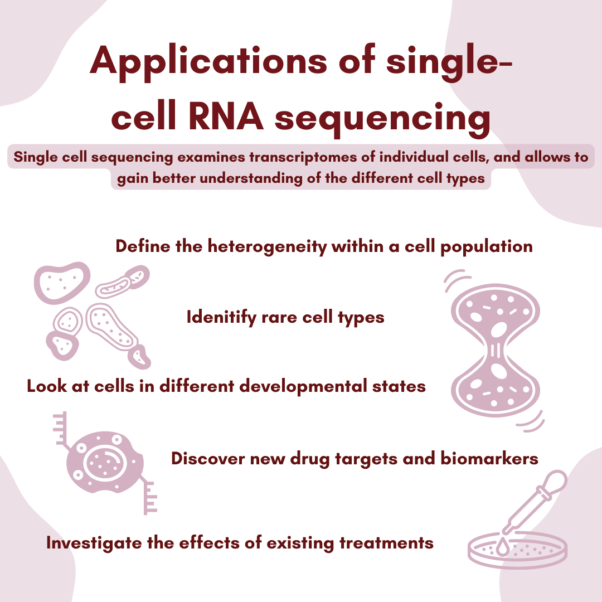
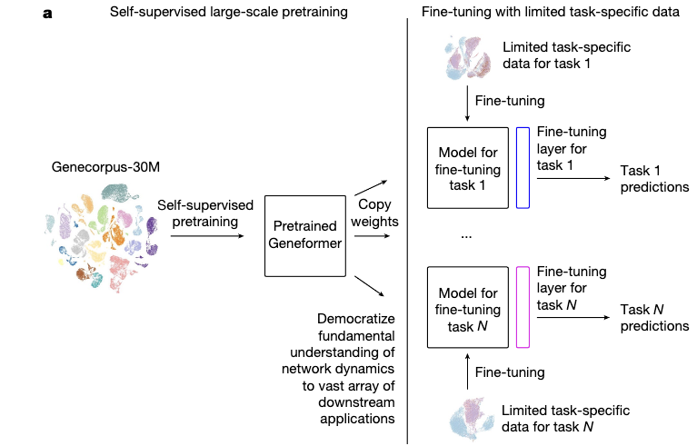

# Fine Tune and Benchmark Geneformer (Single cell RNA-Seq foundation model) For Cell Type/Cell State Classification

This project is a POC for apply machine learning in Single Cell Transcriptomics (scRNA-Seq) to perform cell type annotation.

scRNA-Seq has been gaining popularity in drug discovery research and therapeutic development in recent years. scRNA-Seq provides a high resolution view of gene expression at a single cell level, revealing the heterogeneity of cell populations in healthy and disease states.

## Architecture overview

This architecture consists of two parts.

- The first [notebook](./AHO_r2r_StarSolo.ipynb) demonstrates getting from raw NGS files to gene expression count matrices using AWS HealthOmics Ready2Run workflow.
- The second [notebook](./Finetune_Geneformer_SM_Jobs_MLFlow.ipynb) demonstrates using AWS SageMaker to perform end-to-end machine learning workflow, including data preprocessing, training a logistic regression baseline model, fine tuning Geneformer for cell type classification task, hyperparameter tuning, MLflow experiment tracking, and model deployment.

## Background

### Lab workflow

### Leveraging scRNA-Seq in precision medicine

### Data Flow of scRNA-Seq: from raw data to ML ready

### Machine learning application to automate cell type annotation

### Geneformer - an scRNA-Seq foundation model 

### This project: An End-to-end scRNA-Seq ML workflow

